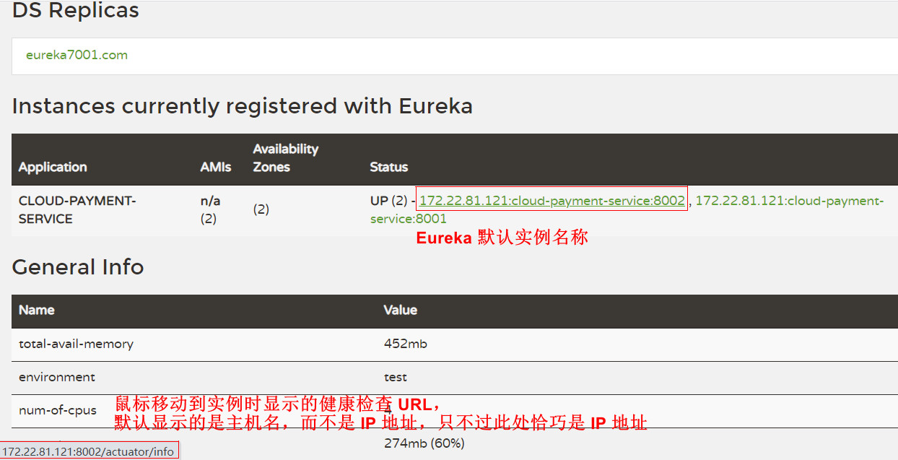

# Eureka 优化

## 一、 完善 actuator 微服务信息
Eureka 管理页面实例名称默认显示的是【主机名+服务名+端口号】，并且当鼠标移动到实例上时，左下角默认显示的是主机名而不是 IP 地址，不够直观。


可以通过以下设置，完善 Eureka 的服务实例信息：
（1）自定义服务实例名称 ： 增加配置项 `eureka.instance.instance-id` 进行自定义实例名称 
（2）服务实例显示 IP 地址 ： 增加配置项 `eureka.instance.prefer-ip-address `

参考配置如下：
```yaml
eureka:
  client:
    register-with-eureka: true
    fetch-registry: true
    service-url:
      defaultZone: http://eureka7001.com:7001/eureka,http://eureka7002.com:7002/eureka
  instance:
    # 自定义服务实例名称
    instance-id: payment8002
    # 服务实例显示 actuator 信息时优先使用 IP 地址
    prefer-ip-address: true
```